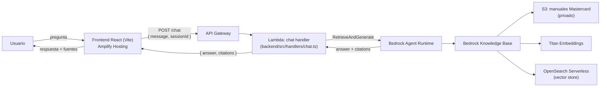

# Mastercard Manuals Chatbot

Chat sobre manuales de Mastercard usando Amazon Bedrock Knowledge Bases.

## Arquitectura



El frontend nunca llama a AWS directamente: todas las llamadas a Bedrock pasan por el backend, la única capa con permisos IAM (`bedrock:RetrieveAndGenerate`, `bedrock:InvokeModel`, lectura de la Knowledge Base).

## Prerrequisitos
- Node.js 20+
- AWS CLI configurado con permisos de administrador
- AWS SAM CLI instalado (`npm install -g aws-sam-local` o desde https://docs.aws.amazon.com/serverless-application-model/latest/developerguide/install-sam-cli.html)

## Desarrollo local

```bash
# Backend (requiere KB de Bedrock configurada en backend/.env)
cd backend && npm install && sam build && sam local start-api --env-vars .env --port 3001

# Frontend
cd frontend && npm install && npm run dev
```

## Estructura

```
/frontend   React chat UI (Vite + TypeScript)
/backend    Lambda handler + Bedrock SDK (SAM)
/infra      Scripts de infraestructura AWS
```

## Variables de entorno (backend/.env)

```
AWS_REGION=us-east-1
BEDROCK_KNOWLEDGE_BASE_ID=<tu-kb-id>
BEDROCK_MODEL_ARN=arn:aws:bedrock:us-east-1::foundation-model/anthropic.claude-3-5-sonnet-20241022-v2:0
S3_MANUALS_BUCKET=mastercard-manuals-<account-id>
FRONTEND_ORIGIN=http://localhost:5173
```
# rag-mastercard-manual
